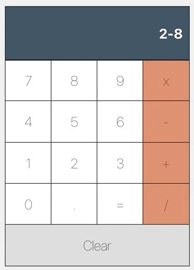

# MSD-Seminar-01
* Write a paper that explains the difference between `useLayoutEffect` and `useEffect`? When to use each with examples?
* Write a React application to manage the state of a calculator using `useReducer` as follows:
```javascript
const state = {
current: {n1: number, n2: number, operation: string, result: number}
history: [
      {n1: number, n2: number, operation: string, result: number}, 
      {n1: number, n2: number, operation: string, result: number}
      ]
}
```
Display the history at the side of the calculator.
  

